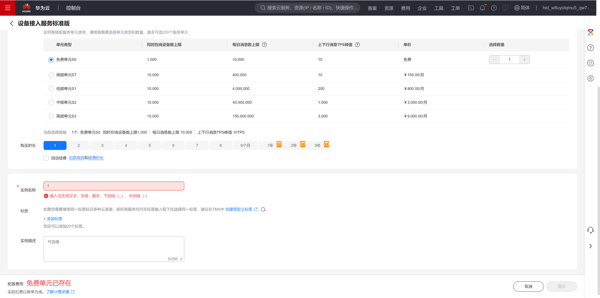
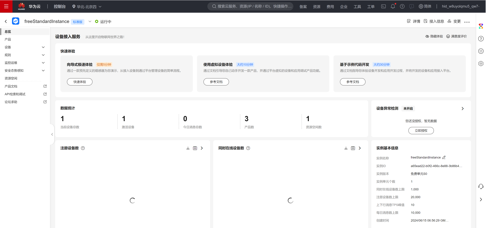

# 参考资料

平台：https://www.huaweicloud.com/product/iot.html

IoTDA ：https://www.huaweicloud.com/product/iothub.html

# IoTDA

## IoTDA 功能

## 帮助中心

https://support.huaweicloud.com/devg-iothub/iot_02_0170.html

## IoTDA 实例

### 创建

### 实例页面

点击具体实例，进入IoTDA 实例平台：

### 产品

#### 产品主页

#### 帮助中心

https://support.huaweicloud.com/devg-iothub/iot_01_0058.html